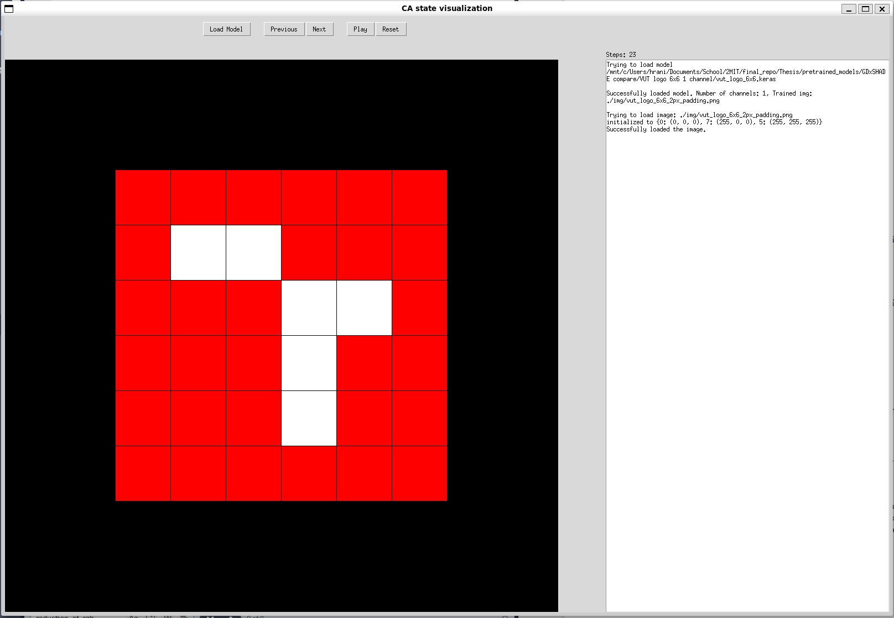

# Thesis

Master's thesis project implementation. Set of experiment regarding based [growing cellular automata model](https://distill.pub/2020/growing-ca/). The repositary contains source code for newly created model of dicrete neural cellular automata (DNCA). Results of the thesis can be seen on [this](https://www.stud.fit.vutbr.cz/~xhrani02/DP/index.html) site.

# Instalation

Repository dependencies are stored in the `requirements.txt` file. They should be installed in a virtual enviromnt. Python 3.10+ is needed.

## Instalation on UNIX systems
```bash
$ python -m venv venv
$ source venv/bin/activate
$ python -m pip install -r requirements.txt
```
## Instalation on Windows

```bash
$ python -m venv venv
$ cd ./venv/Scripts 
$ activate.bat
$ python -m pip install -r requirements.txt
```

# Running an experiment

There are two different algoritms used to train the DNCA model. Gradient descent via Adam and SHADE, variation of differential evolution. The accept these parameters:


```bash
$ dnca.py [-h] [-c CHANNELS] [-i ITERS] [-s STATES] [-t TRAIN_INTERVAL]
[-m IMAGE] [-r RUN] [-f FOLDER] [-g FULL_RANGE] [-l LR] [-w SAVE_ITERS] [-v GIF_ITERS] 
```
```bash
$ shade.py [-h] [-c CHANNELS] [-i ITERS] [-s STATES] [-t TRAIN_INTERVAL]
[-d STD_DEV] [-p POP_SIZE] [-x CROSS_OPERATOR] [-a IMAGE][-r RUN] [-f FOLDER]
[-m ARCHIVE_LEN] [-e REPETION_PER_RUN]
```

### Basic example of running the training scripts
ADAM:
```bash
$ python -m experiments.dnca      
$ python -m experiments.dnca -c 16 -m ./img/xhrani02.png -i 100000 -s 8 -f ./xhrani02_test/
```


SHADE:
```bash
$ python -m experiments.shade    
$ python -m experiments.shade -f ./shade_test/ -c 1 -i 2000 -p 50 -a ./img/vut_logo_6x6_2px_padding.png -m 20 -x interm  
```

# Results

Both training scripts store results in the follow format, where I stands for iteration:

- {I}.gif -- gif showing the steps of the trained CA
- {I}.index -- tensorflow models
- checkpoint.
- loss.png -- convergence graph 
- convergenceq_arr.npy -- numpy array with best values of loss function across iterations

### Plotting scripts
There are 2 plotting scripts in the repositary `box_plot_fitness.py` and `plot_convergence.py`. They collect data from all runs and plot box plot of the best loss function values and convergence curves into a single plot. Scripts work recursively on given folder.

They can be run using followign commands:

```bash
$ python plot_convergence.py
$ python plot_convergence.py -f ./relative_path/to_a_folder/with_results
-p ./relative_path_to_a_folder_which_will_store_the_results

$ python box_plot_fitness.py 
$ python box_plot_fitness.py  -f ./relative_path/to_a_folder/with_results
-p ./relative_path_to_a_folder_which_will_store_the_results
```

### Visualization app
Alternatively to the generated gifs there is a simple GUI app that can be used to visualize the computation of the trained CA. User can load `.keras` model and can see the computation on the level of single steps. 

The app can be run using the following command:

```bash
$ python visualizer.py
```

The GUI app is shown on the image below


